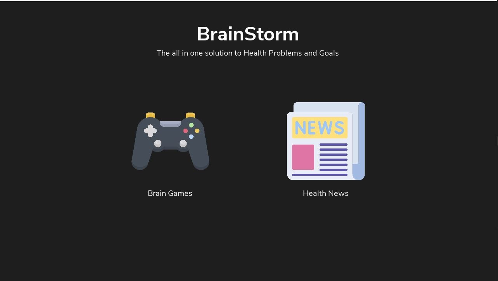

# BrainStorm

Brainstorm is application that allows you to keep track of your mental score and also allows to create scheldule your daily life with daily exercises as well, or at least that is the plan for now

---

## How to Run

Python 3.x or higher should be instaled

```shell
pip install -r requirements.txt
python main.py
```

---

## ScreenShots

### Home Screen



### Choose Game Screen


### Feeding Koi Game


### Memory Matirx Gmae


### Color Match Game


---

## Checklist of Tasks on the Application

Priority Level 3 being "This has to be in the Application" and 1 being "This can be ignored if I am low on time"

- [x] Brain Games Application [Priority: 3] Not Fully Completed, Three games created
- [x] News Features [Priority: 2.5]
- [ ] Daily Exercises [Priority: 2]
- [ ] Schedule Making [Priority: 1.5]
